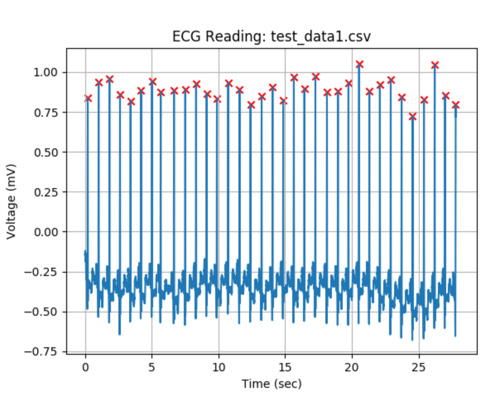

# bme590hrm

# Overview
Code is titled HRM_main.py. It takes in a .csv file containg ECG voltages and corresponding times and outputs a .json file containing the average heart rate in BPM, the minimum and maximum recorded voltages, the time duration of the ECG reading, the number of heart beats detected in the reading, and the times at which those heart beats occurred. The code also generates a graph of the ECG trace with the detected peaks marked with a red x. A sample output of the image can be found below.  

# How to use 
First, change the "file_type' variable to the desired input file type. Currently, only .csv files are supported and any other types will raise and error. Next, change the 'file_name' variable to the name of the desired input file. If you want to run a file not contained in the 'test_data' folder, change the path as well. Finally, select the voltage unit of the data that is to be analyzed. Running the file will then produce all desired outputs. 
# Notes 
If graphical outputs are desired, the specified sections of code must be uncommented. 
